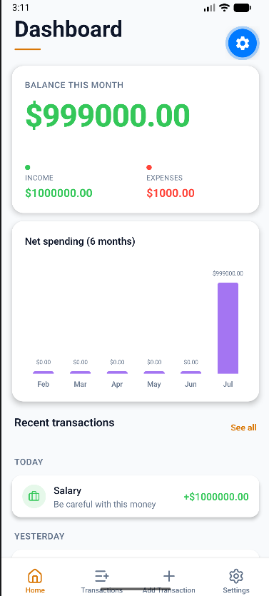
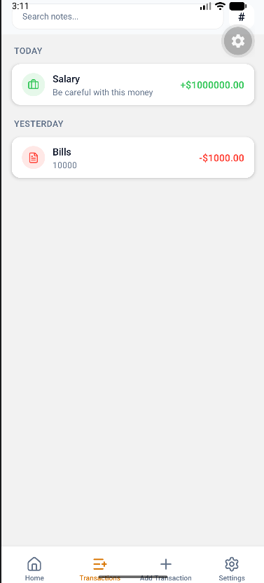
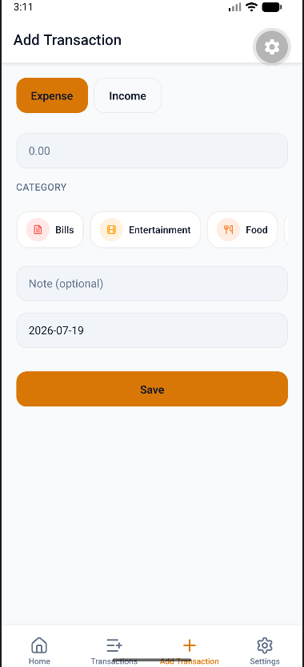
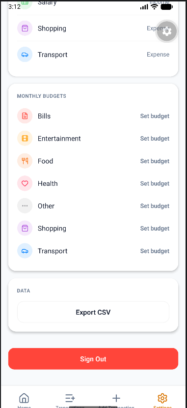

# Expense Tracker

A mobile expense tracking app built with React Native (Expo SDK 57) and Supabase. Features a premium dark-mode UI with real-time income/expense tracking, budget management, and spending analytics.

## Tech Stack

- **Framework:** React Native 0.86 / Expo SDK 57
- **Navigation:** expo-router (file-based routing)
- **Backend:** Supabase (auth, database)
- **Icons:** lucide-react-native
- **Animations:** react-native-reanimated + react-native-worklets
- **Storage:** @react-native-async-storage/async-storage (local budgets)

## Features

- **Authentication** — Email/password sign-up and login via Supabase Auth
- **Dashboard** — Monthly balance summary, 6-month spending chart, budget progress, recent transactions
- **Transactions** — Full list with search, filter by category/type, add/edit/delete
- **Add Transaction** — Quick entry with amount, category picker, date, and notes
- **Settings** — Category management, monthly budget limits per category, CSV export, sign out
- **Dark Mode** — OLED-friendly dark theme with gold/purple accent palette
- **Animations** — Press feedback with scale transitions on interactive elements

## Getting Started

### Prerequisites

- Node.js 18+
- Expo CLI (`npx expo`)
- A Supabase project

### Setup

1. Clone the repo:
   ```
   git clone https://github.com/nofilkhan1/Expense-tracker.git
   cd expense-tracker
   ```

2. Install dependencies:
   ```
   npm install --legacy-peer-deps
   ```

3. Create a `.env` file in the root with your Supabase credentials:
   ```
   EXPO_PUBLIC_SUPABASE_URL=https://your-project.supabase.co
   EXPO_PUBLIC_SUPABASE_ANON_KEY=your-anon-key
   ```

4. Run the app:
   ```
   npx expo start
   ```

### Supabase Setup

Run the following SQL in your Supabase SQL editor to create the required tables:

```sql
CREATE TABLE categories (
  id UUID DEFAULT gen_random_uuid() PRIMARY KEY,
  user_id UUID REFERENCES auth.users(id) ON DELETE CASCADE NOT NULL,
  name TEXT NOT NULL,
  icon TEXT DEFAULT 'more-horizontal',
  color TEXT DEFAULT '#8E8E93',
  type TEXT CHECK (type IN ('expense', 'income')) NOT NULL,
  created_at TIMESTAMPTZ DEFAULT now()
);

CREATE TABLE transactions (
  id UUID DEFAULT gen_random_uuid() PRIMARY KEY,
  user_id UUID REFERENCES auth.users(id) ON DELETE CASCADE NOT NULL,
  category_id UUID REFERENCES categories(id) ON DELETE SET NULL,
  amount DECIMAL(12,2) NOT NULL,
  type TEXT CHECK (type IN ('expense', 'income')) NOT NULL,
  note TEXT,
  transaction_date DATE NOT NULL,
  created_at TIMESTAMPTZ DEFAULT now()
);

-- Enable Row Level Security
ALTER TABLE categories ENABLE ROW LEVEL SECURITY;
ALTER TABLE transactions ENABLE ROW LEVEL SECURITY;

-- Create policies
CREATE POLICY "Users manage own categories"
  ON categories FOR ALL USING (auth.uid() = user_id);

CREATE POLICY "Users manage own transactions"
  ON transactions FOR ALL USING (auth.uid() = user_id);
```

## Project Structure

```
expense-tracker/
├── app/                  # expo-router pages
│   ├── (auth)/           # Login & signup
│   ├── (tabs)/           # Main tab screens
│   └── transaction/      # Edit transaction screen
├── components/           # Reusable UI components
│   └── ui/               # Button, Input
├── constants/            # Theme, categories, icons
├── contexts/             # Auth & Theme providers
├── hooks/                # useAuth, useTransactions, etc.
└── lib/                  # Supabase client, formatters, types
```

## Screenshots

| Dashboard | Transactions | Add Transaction | Settings |
|-----------|-------------|-----------------|----------|
|  |  |  |  |

## Screens

- **Dashboard** — Balance card, spending chart, budget progress, recent transactions
- **Transactions** — Searchable/filterable transaction list
- **Add Transaction** — Form to add income or expense
- **Settings** — Categories, budgets, CSV export, sign out
